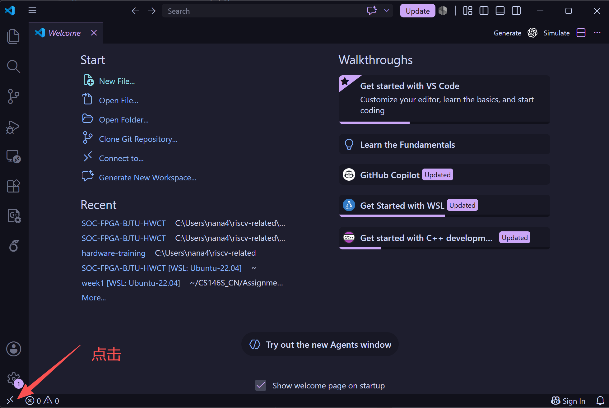

# Windows 上安装 Ubuntu 22.04 WSL2

本文说明如何在 Windows 上下载并安装 Ubuntu 22.04 的 WSL2 环境。目标是为后续 Linux 编译、仿真和命令行操作提供稳定入口。这样遇到环境问题时，不必每次临时查资料。

WSL（Windows Subsystem for Linux，适用于 Linux 的 Windows 子系统）可以在 Windows 中直接运行 Linux 命令行环境。WSL2 使用轻量虚拟化机制，兼容性和性能通常更适合开发场景。对于本实验工程来说，Windows 侧适合使用 Vivado，Ubuntu 侧适合运行 `make`、交叉编译工具链、NEMU 和 Verilator 等工具。

---

## 1. 安装前检查

安装前先确认三件事：Windows 版本、虚拟化支持和网络环境。WSL2 对 Windows 版本和虚拟化功能有要求，提前检查可以少走很多弯路。

### 1.1 检查 Windows 版本

按 `Win + R`，输入：

```PowerShell
winver
```

建议使用 Windows 11，或者 Windows 10 2004（Build 19041）及以上版本。Microsoft 官方文档说明，`wsl --install` 命令需要 Windows 10 2004（Build 19041）及以上版本，或 Windows 11。

如果 Windows 版本过低，请先在“设置 → Windows 更新”中升级系统。版本不满足要求时，即使命令能输入，也可能在安装内核或启动发行版时失败。

### 1.2 确认 CPU 虚拟化已开启

打开“任务管理器 → 性能 → CPU”，查看右下角的“虚拟化”。如果显示“已启用”，可以继续安装。

如果显示“已禁用”，需要进入 BIOS 或 UEFI 设置，开启 Intel VT-x、Intel Virtualization Technology、AMD-V 或 SVM Mode。不同主板的名称略有差异，但含义都是开启硬件虚拟化。

### 1.3 准备网络

安装 Ubuntu 22.04 时需要从 Microsoft 的在线源下载 WSL 组件和 Linux 发行版。网络不稳定时，安装可能卡在 `0.0%` 或提示下载失败。

下载时需要开启代理或使用科学上网，否则可能无法下载。

如果下载一直卡住，可以在后续步骤中使用：

```PowerShell
wsl --install --web-download -d Ubuntu-22.04
```

`--web-download` 会让 WSL 先通过网页下载方式获取发行版，适合 Microsoft Store 下载不稳定的情况。

---

## 2. 操作流程

推荐流程适用于大多数 Windows 10 新版本和 Windows 11 电脑。所有命令都在 Windows PowerShell 或 Windows Terminal 中执行。

### 2.1 以管理员身份打开 PowerShell

在开始菜单中搜索 `PowerShell`，右键选择“以管理员身份运行”。如果你使用 Windows Terminal，也可以右键选择“以管理员身份运行”，再打开 PowerShell 标签页。

后续命令需要修改 Windows 可选组件，普通权限可能会失败。

### 2.2 查看可安装的 Linux 发行版

先执行：

```PowerShell
wsl --list --online
```

这个命令会列出当前电脑可在线安装的发行版名称。系统会让你按任意键下载适用于 Linux 的 Windows 子系统。

不同 Windows 和 Store 版本显示的名称可能略有不同。后续 `-d` 后面的名称必须使用列表中的 `NAME`，不要只看展示名。

### 2.3 安装 Ubuntu 22.04

如果列表中显示的名称是 `Ubuntu-22.04`，执行：

```PowerShell
wsl --install -d Ubuntu-22.04
```

如果列表中显示的是其他精确名称，请把 `Ubuntu-22.04` 替换成你电脑上显示的 `NAME`。例如：

```PowerShell
wsl --install -d <发行版名称>
```

该命令会启用 WSL 和 Virtual Machine Platform 相关组件，下载并安装 WSL 内核，同时安装指定的 Ubuntu 发行版。安装过程中 Windows 可能提示重启，请按提示重启。

---

## 3. 安装 VS Code 并连接 WSL

Ubuntu 安装完成后，建议在 Windows 侧安装 VS Code，再通过 WSL 插件连接 Ubuntu。不要在 Ubuntu 中单独安装 Linux 版 VS Code。

### 3.1 下载并安装 VS Code

打开 VS Code 官网：

```text
https://code.visualstudio.com/
```

下载 Windows 稳定版安装包。安装时建议勾选 `Add to PATH`，这样后续可以在 WSL 终端中使用 `code .` 打开当前目录。

### 3.2 安装 WSL 插件

点击左下角标识，选择 WSL，VS Code 会自动安装。



### 3.3 从 WSL 打开工程

安装结束后，继续点击左下角，选择 WSL，VS Code 会在左侧选择工作目录。此时表示 VS Code 已经连接到 WSL。

```bash
cd ~/SOC-FPGA-BJTU-HWCT
code .
```

第一次打开时，VS Code 会自动在 WSL 中安装 VS Code Server。窗口左下角显示 `WSL: Ubuntu-22.04` 时，说明已经连接到 WSL。

---

## 4. 可能遇到的问题

安装 WSL 环境时，可能遇到如下问题。

### 4.1 家庭版 Windows 无法开启 Hyper-V 虚拟化

需要将家庭版 Windows 升级为专业版，参考内容如下：

```text
https://baijiahao.baidu.com/s?id=1824539242610246791&wfr=spider&for=pc
```

后续操作系统激活可以使用校园激活工具：

```text
http://genuine.bjtu.edu.cn/index/index/index.html
```

### 4.2 Hyper-V 启动一直卡在“Windows 功能正在搜索需要的文件”

新建文本文件：

```bat
pushd "%~dp0"

dir /b %SystemRoot%\servicing\Packages\*Hyper-V*.mum >hv.txt

for /f %%i in ('findstr /i . hv.txt 2^>nul') do dism /online /norestart /add-package:"%SystemRoot%\servicing\Packages\%%i"

del hv.txt

Dism /online /enable-feature /featurename:Microsoft-Hyper-V -All /LimitAccess /ALL

Pause
```

保存之后，将这个文本文档的扩展名由默认的 `txt` 修改为 `bat`，并将此文件命名为 `Hyper-V.bat`，然后以管理员权限运行。

我们也提供了现成的脚本：[Hyper-V.bat](./scripts/hyperv.bat)。

---

## 5. 参考资料

- [Microsoft Learn：Install WSL](https://learn.microsoft.com/en-us/windows/wsl/install)
- [Microsoft Learn：Basic commands for WSL](https://learn.microsoft.com/en-us/windows/wsl/basic-commands)
- [Microsoft Learn：Manual installation steps for older versions of WSL](https://learn.microsoft.com/en-us/windows/wsl/install-manual)
- [Microsoft Learn：Set up a WSL development environment](https://learn.microsoft.com/en-us/windows/wsl/setup/environment)
- [Ubuntu：Ubuntu on WSL](https://ubuntu.com/wsl)
- [Visual Studio Code：Developing in WSL](https://code.visualstudio.com/docs/remote/wsl)
